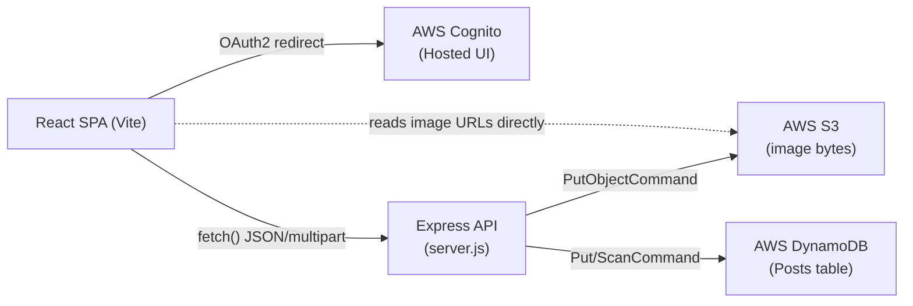
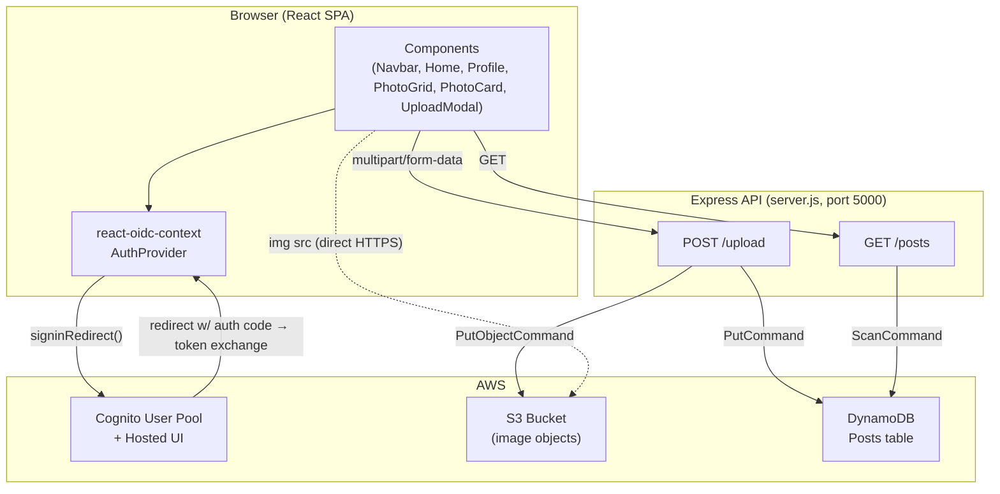
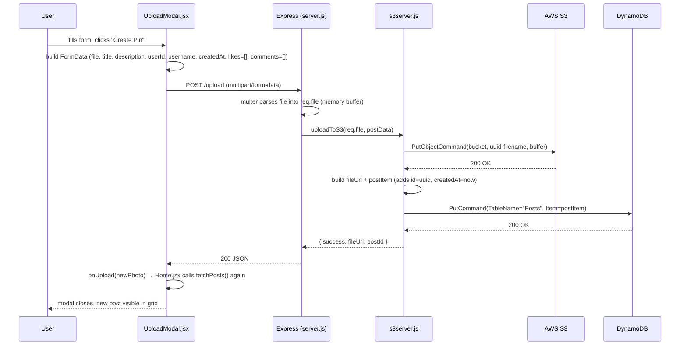
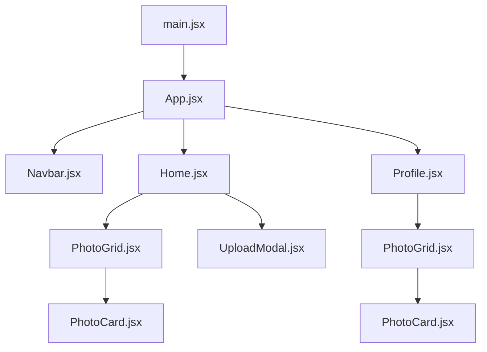
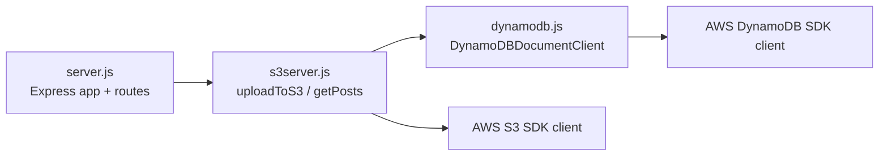
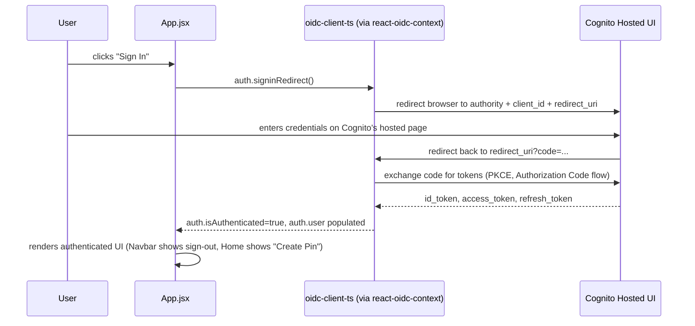
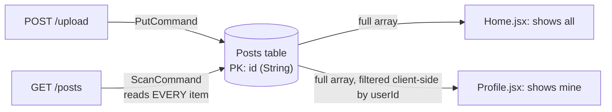
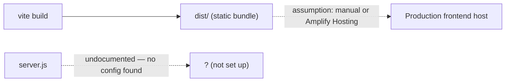

# PinterestAWS — Engineering Reference

> A Pinterest-style photo-sharing app: React SPA + Express API + AWS S3/DynamoDB/Cognito.
> This document is written for **future-you**. Read it top to bottom once, then use it as a lookup table.

**Status: prototype / learning project.** Core browse-and-upload flow works. Auth is real (Cognito OAuth2). Likes/comments are UI-only (not persisted). No tests, no CI, no deployment pipeline. This README says so explicitly wherever that matters — it does not pretend the project is more finished than it is.

---

## Table of Contents

1. [Project Overview](#1-project-overview)
2. [Folder Structure](#2-folder-structure)
3. [System Architecture](#3-system-architecture)
4. [Project Flow](#4-project-flow)
5. [Code Flow](#5-code-flow)
6. [Logic Explanation (Key Modules)](#6-logic-explanation-key-modules)
7. [Feature Breakdown](#7-feature-breakdown)
8. [API Documentation](#8-api-documentation)
9. [Database Documentation](#9-database-documentation)
10. [State Management](#10-state-management)
11. [Authentication & Authorization](#11-authentication--authorization)
12. [Error Handling](#12-error-handling)
13. [Important Algorithms](#13-important-algorithms)
14. [Design Decisions](#14-design-decisions)
15. [Performance Optimizations](#15-performance-optimizations)
16. [Security](#16-security)
17. [Configuration](#17-configuration)
18. [Deployment](#18-deployment)
19. [Complete File Explanation](#19-complete-file-explanation)
20. [End-to-End Execution Walkthrough](#20-end-to-end-execution-walkthrough)
21. [Common Bugs & Gotchas](#21-common-bugs--gotchas)
22. [Future Improvements](#22-future-improvements)
23. [Interview Preparation](#23-interview-preparation)
24. [Viva / Presentation Notes (10 minutes)](#24-viva--presentation-notes-10-minutes)
25. [Quick Revision Sheet](#25-quick-revision-sheet)
26. [Running the Project](#26-running-the-project)

---

## 1. Project Overview

### What problem does this solve?

A minimal clone of Pinterest's core loop: **sign in → browse a photo grid → upload an image with a title/description → see it appear for everyone**. It exists to practice wiring together a React frontend, a small Node API, and three AWS managed services (S3 for files, DynamoDB for metadata, Cognito for identity) without a heavyweight framework (no Amplify backend, no CDK, no Lambda) in between.

### Why was this project built?

**Assumption** (inferred from the code, not stated anywhere in the repo): this is a personal learning project to practice the "React + Express + raw AWS SDK" stack end-to-end — specifically OAuth2/OIDC login against Cognito, direct S3 uploads via a Node backend, and DynamoDB as a NoSQL document store. The repo has 2 commits ("Initial commit", "Code commit"), no CI, no tests, and several half-finished/duplicate files — consistent with iterative, exploratory development rather than a production build-out.

### Who are the users?

A single class of user: anyone who authenticates via Cognito. There is no admin role, no moderation, no follow/social graph — everyone sees everyone's posts on `/`, and their own subset on `/profile`.

### High-level architecture



- The browser **never talks to S3 or DynamoDB directly** for writes — everything funnels through the Express API, which holds the AWS credentials.
- The browser **does** load `` directly from S3 (public bucket URLs), bypassing the API for reads of image bytes.
- Cognito is the one AWS service the browser talks to directly (standard OAuth2 Authorization Code flow via redirect — the API is never involved in login).

### Key features

| Feature | Where | Status |
|---|---|---|
| Cognito sign in / sign out | `src/main.jsx`, `src/App.jsx` | Working |
| Browse all posts (masonry-ish grid) | `src/pages/Home.jsx` | Working |
| View only your own posts | `src/pages/Profile.jsx` | Working |
| Upload image + title + description | `src/components/UploadModal.jsx` → `s3server.js` | Working |
| Like a post | `src/components/PhotoCard.jsx` | **UI-only, not persisted** (see [§21](#21-common-bugs--gotchas)) |
| Comment on a post | `src/components/PhotoCard.jsx` | **UI-only, not persisted** |
| Search bar | `Navbar.jsx` | **Decorative only** — no `onChange`/submit handler wired up |
| "Explore" nav link | `Navbar.jsx` | **Dead link** — no `/explore` route exists in `App.jsx` |

### Tech stack with reasons for choosing each technology

| Technology | Why it was (likely) chosen | Alternative |
|---|---|---|
| **React 18 + Vite** | Fast dev server, component model fits a grid-of-cards UI, huge ecosystem for learning | Next.js (adds SSR/routing you don't need for a client-only demo) |
| **react-router-dom v7** | Client-side routing between `Home` and `Profile` without a full page reload | TanStack Router |
| **react-oidc-context** | Thin wrapper over `oidc-client-ts` — gives you `useAuth()` with almost no boilerplate for a standard OAuth2/OIDC Authorization Code flow against Cognito | Amplify Auth (`@aws-amplify/ui-react` is installed but **not used** — see [§14](#14-design-decisions)), hand-rolled `fetch` + token storage |
| **AWS Cognito (Hosted UI)** | Managed user pool, no password storage/hashing to build yourself | Auth0, Firebase Auth, custom JWT server |
| **Express.js** | Smallest possible HTTP server to sit between the browser and AWS credentials — you cannot put S3/DynamoDB secret keys in browser code | AWS API Gateway + Lambda, Fastify |
| **Multer (memory storage)** | Express has no built-in multipart/form-data parser; memory storage avoids writing temp files to disk before forwarding the buffer straight to S3 | `busboy` directly, disk storage |
| **AWS S3 (`@aws-sdk/client-s3`)** | Object storage for image binaries — cheap, durable, and returns a public URL you can put straight in `` | Cloudinary, local disk (`public/uploads`) |
| **AWS DynamoDB (`@aws-sdk/lib-dynamodb`)** | Serverless NoSQL store for post metadata — no schema migrations, pay-per-request friendly for a low-traffic demo | PostgreSQL/RDS, MongoDB Atlas |
| **ESLint (flat config)** | Catch bugs like unused vars / hook-rule violations before they ship | — |
| **`dotenv`** | Load AWS credentials/region/bucket from a local `.env` file instead of hardcoding them | — |

---

## 2. Folder Structure

```
PinterestAWS/
├── index.html                 # Vite HTML entry point
├── vite.config.js             # Vite + React plugin config
├── eslint.config.js           # Flat ESLint config (browser rules for src/, Node rules for root *.js)
├── package.json               # Scripts + dependencies
├── server.js                  # Express API entry point (the backend "main")
├── s3server.js                # S3 upload + DynamoDB write/read logic — imported by server.js
├── dynamodb.js                # DynamoDB client factory — imported by s3server.js and once.js
├── once.js                    # One-off script: creates the "Posts" DynamoDB table
├── Services.jsx                # DEAD — orphaned duplicate of s3server.js, sits outside src/
├── public/
│   ├── assets/pinterest_logo.png
│   └── vite.svg
└── src/
    ├── main.jsx                # React entry point — wraps <App/> in Cognito <AuthProvider>
    ├── App.jsx                 # Router root — defines "/" and "/profile" routes
    ├── App.css, index.css      # Global styles + CSS variables (theme colors)
    ├── components/
    │   ├── Navbar/              # Top nav bar (logo, search box, sign in/out, profile link)
    │   ├── PhotoGrid.jsx        # Maps an array of posts → <PhotoCard> grid
    │   ├── PhotoCard.jsx        # Single post: image, like button, comments
    │   ├── UploadModal.jsx      # "Create Pin" form (the real, wired-up upload UI)
    │   ├── Header.jsx           # DEAD — unused, imports a module that doesn't exist
    │   ├── UploadButton.jsx     # DEAD — unused, superseded by UploadModal.jsx
    │   ├── UploadS3.jsx         # DEAD — unused, references an undefined `Auth` import
    │   ├── ReceivingS3.jsx      # DEAD — 100% commented out
    │   ├── CommentSection.jsx  # DEAD — empty file
    │   ├── MasonryGrid/         # DEAD — unused demo component, hardcoded sample data
    │   └── Pin/                 # DEAD — only used by the dead MasonryGrid
    └── pages/
        ├── Home.jsx             # "/" — all posts
        └── Profile.jsx          # "/profile" — current user's posts only
```

### Folder-by-folder intent

| Folder | Purpose | What belongs here | What should never go here |
|---|---|---|---|
| `src/pages/` | One file per **route** (top-level screen) | Data fetching for that screen (`useEffect` + `fetch`), composing components, route-guard logic (`if (!isAuthenticated) ...`) | Reusable UI pieces used by more than one page — those belong in `components/` |
| `src/components/` | Reusable, route-agnostic UI pieces | Presentational components, small pieces of local state (`useState`) | Route definitions, `fetch()` calls to endpoints only one page needs |
| `src/components/<Feature>/` (e.g. `Navbar/`) | Co-locate a component with its own CSS file | The `.jsx` + its dedicated `.css` | Unrelated components — one subfolder per cohesive UI unit |
| Root `*.js` (`server.js`, `s3server.js`, `dynamodb.js`) | The Express backend | AWS SDK calls, request handlers, anything that touches a secret key | React/JSX code, anything imported by the Vite bundle |
| `public/` | Static assets served as-is by Vite, no processing | Logos, favicons | Anything imported via JS (use `src/assets/` — which doesn't exist yet — for that) |

**Why the backend files live at the project root instead of a `server/` folder:** this project shares one `package.json` and one `node_modules` between frontend and backend (a "monorepo of one"). **Assumption:** this was likely simplicity — no workspace tooling (no npm/pnpm workspaces) was set up, so both halves had to share a root. The cost is exactly what you see in this repo: it's easy to lose track of which `.js` files are backend-only, and one dead file (`Services.jsx`) already leaked into the wrong place. If this project grows, move backend code into `server/` and add it to `eslint.config.js`'s Node-globals block explicitly.

---

## 3. System Architecture

### Overall Architecture



### Request Flow (an upload, end to end)



### Component Interaction



- Data (posts, user) flows **down** via props only — no context, no global store (see [§10](#10-state-management)).
- Actions flow **up** via callback props (`onUpload`, `onClose`) — standard "lift state up" React pattern.

### Backend Flow



There is **no controller/service/repository layering** — `server.js` route handlers call `s3server.js` functions directly, which call the AWS SDK directly. For 2 routes and 2 AWS services, an extra layer would be pure ceremony. **Design note:** if a 3rd or 4th resource type is added, introduce a `routes/`, `services/` split before it gets unwieldy — right now the entire "service layer" is 2 files.

### Authentication Flow



### Database Flow



**Why `Profile.jsx` filters client-side instead of querying by `userId`:** the DynamoDB table has only a partition key on `id` — no secondary index on `userId`. A `Query` needs an index to filter by a non-key attribute; without one, the only options are `Scan` (read everything, discard client-side) or `Scan` + a server-side filter (same cost, less data over the wire). This project does the cheapest-to-write option: one `Scan` shared by both pages, filtered in the React component. It works at demo scale (dozens of posts) and gets expensive/slow at real scale — see [§22](#22-future-improvements).

### Deployment Flow

**Assumption:** there is no deployment pipeline configured in this repo (no `Dockerfile`, no `.github/workflows`, no `amplify.yml`). The only deployment evidence is a **commented-out** redirect URI in `main.jsx`/`App.jsx` pointing at `https://main.dp42myfy09fyo.amplifyapp.com/`, suggesting the frontend was at some point deployed to **AWS Amplify Hosting**, with `localhost:5173` as the active dev URI now. The backend's deployment target is undocumented — Amplify Hosting only serves static frontends, so `server.js` would need a separate host (EC2, Elastic Beanstalk, Lambda+API Gateway, etc.) that isn't set up here.



---

## 4. Project Flow

Full lifecycle from a cold browser tab to a rendered, interactive page:

```
User opens http://localhost:5173
      ↓
index.html loads, <script type="module" src="/src/main.jsx"> runs
      ↓
main.jsx: ReactDOM.createRoot(...).render(<AuthProvider><App/></AuthProvider>)
      ↓
AuthProvider (react-oidc-context) initializes — checks browser storage for an existing OIDC session
      ↓
App.jsx: const auth = useAuth()
      ↓
   ┌─ auth.isLoading === true  → render "Loading..." and stop here
   ├─ auth.error               → render error message and stop here
   └─ otherwise                → render <Router> with Navbar + Routes
      ↓
Router matches the current URL:
   "/"         → <Home user={auth.user} isAuthenticated={auth.isAuthenticated} />
   "/profile"  → <Profile .../> if authenticated, else <Navigate to="/" />
      ↓
Home.jsx mounts → useEffect fires once → fetchPosts()
      ↓
fetch("http://localhost:5000/posts") — GET, no auth header, no body
      ↓
Express server.js → getPosts() in s3server.js → DynamoDB ScanCommand
      ↓
Full array of post items returned as JSON
      ↓
setPhotos(data) → PhotoGrid renders one <PhotoCard> per post
      ↓
User is now looking at a populated grid. If not authenticated: only "Sign In" is visible,
no "Create Pin" button, "/profile" redirects back to "/".
```

**Every transition explained:**

| Step | Why it happens this way |
|---|---|
| `auth.isLoading` gate before rendering routes | `react-oidc-context` needs a tick to check for an existing session in browser storage before you know if the user is logged in — rendering routes before that would flash a "logged out" UI even for returning users |
| `fetchPosts()` in a `useEffect([])`, not on module load | Data fetching has to happen after mount (React components can't `await` in the function body); empty deps array = "run once when this page appears" |
| No loading spinner while `/posts` is in flight | **Gap, not a design choice.** `photos` starts as `[]`, so the grid is just empty until the fetch resolves — no visual feedback. See [§22](#22-future-improvements). |
| `/profile` redirects unauthenticated users via `<Navigate>` | Client-side-only guard — there's no server check preventing a direct API call to see someone's data; the redirect is a UX nicety, not a security boundary (see [§16](#16-security)) |

---

## 5. Code Flow

There are no controllers/services/repositories in the classic layered sense — this is a **2-hop backend**:

```
server.js (route handlers)
      ↓
s3server.js (business logic: talk to S3, talk to DynamoDB)
      ↓
dynamodb.js (AWS client construction only)
      ↓
AWS SDK v3 (@aws-sdk/client-s3, @aws-sdk/client-dynamodb, @aws-sdk/lib-dynamodb)
      ↓
AWS (S3, DynamoDB)
```

**Who calls whom:**

- `server.js` imports `{ uploadToS3, uploadMiddleware, getPosts }` from `s3server.js`. It never imports the AWS SDK directly.
- `s3server.js` imports `{ dynamodb }` (the `DynamoDBDocumentClient`) from `dynamodb.js`, and constructs its own `S3Client` inline (S3 client isn't shared/exported — **minor inconsistency**: DynamoDB client is centralized, S3 client isn't).
- `dynamodb.js` has no dependents besides `s3server.js` and `once.js` — it exists purely to avoid constructing a new `DynamoDBClient` in two places.
- `once.js` is **not** part of the request-handling code flow — it's a manual, run-once table-provisioning script (`node once.js`), not wired into any npm script.

On the frontend, "routing → controller → service" maps loosely like this:

```
main.jsx (mount)
      ↓
App.jsx (routing — react-router-dom)
      ↓
Home.jsx / Profile.jsx  ("controllers" — own the fetch calls & page-level state)
      ↓
PhotoGrid.jsx / UploadModal.jsx  ("views" — pure rendering + local form state)
      ↓
PhotoCard.jsx  (leaf component — per-item rendering + local like/comment UI state)
```

There is no frontend "service layer" (no `src/services/api.js`) — every page calls `fetch("http://localhost:5000/...")` with a hardcoded URL directly inside its own component. **This is a real maintenance smell**: the base URL `http://localhost:5000` is duplicated in `Home.jsx`, `Profile.jsx`, and `UploadModal.jsx`. Changing the API host means editing 3 files. See [§22](#22-future-improvements).

---

## 6. Logic Explanation (Key Modules)

### `s3server.js` → `uploadToS3(file, postData)`

- **Purpose:** persist one new post — both the image bytes (S3) and its metadata (DynamoDB) — as a single logical operation.
- **Inputs:** `file` (Multer file object: `{ originalname, buffer, mimetype }`), `postData` (`{ userId, username, title, description, createdAt, likes, comments }` parsed from the multipart form fields in `server.js`).
- **Outputs:** `{ success: true, fileUrl, postId }` on success; throws `Error("Upload or database insert failed")` on any failure (S3 or DynamoDB).
- **Internal logic:**
  1. Guard: throw if no file.
  2. Generate a collision-proof key: `crypto.randomUUID() + "." + extension`.
  3. `PutObjectCommand` to S3 with the raw buffer and `ContentType` from Multer.
  4. Build the S3 URL by string concatenation (`https://{bucket}.s3.{region}.amazonaws.com/{key}`) — **not** returned by the SDK, constructed manually.
  5. Build a `postItem` with a **second, independent** `crypto.randomUUID()` as the DynamoDB partition key (`id`) — note this is a different UUID from the S3 object key; they are only related because both were generated in the same request.
  6. `PutCommand` to DynamoDB.
  7. Return the result.
- **Edge cases:**
  - S3 upload succeeds but DynamoDB write fails → **orphaned S3 object**, no compensating delete/rollback. The image exists in the bucket forever with nothing pointing to it.
  - `postData.likes`/`postData.comments` arrive as JSON *strings* from the form (`JSON.parse`d in `server.js` before this function ever sees them) — if that parse ever throws (malformed JSON from a hand-crafted request), the whole request 500s before reaching `uploadToS3`.
  - No file-type or file-size validation — Multer's `memoryStorage()` buffers the entire file in server RAM with no `limits` configured.
- **Complexity:** O(1) — one S3 call, one DynamoDB call, no loops over user data.
- **Common mistakes to watch for:** assuming `fileUrl` is guaranteed reachable — if the bucket isn't configured for public read, every image in the grid 403s despite the upload API reporting success.
- **Future improvement:** wrap steps 3–6 so a DynamoDB failure deletes the just-uploaded S3 object (compensating transaction), or use S3 presigned URLs + a DynamoDB Stream trigger instead of doing both writes synchronously in the request handler.

### `s3server.js` → `getPosts()`

- **Purpose:** return every post in the table.
- **Inputs:** none.
- **Outputs:** `Array<PostItem>` (raw DynamoDB items, no transformation).
- **Internal logic:** one `ScanCommand` against `Posts`, return `data.Items`.
- **Edge cases:** `ScanCommand` with no `Limit`/pagination — if the table exceeds 1 MB of scanned data, DynamoDB returns a `LastEvaluatedKey` and only a partial result set; this code **ignores that entirely**, so posts silently stop appearing once the table is large enough. No `ExclusiveStartKey` loop exists.
- **Complexity:** O(n) DynamoDB read-capacity cost where n = total items in the table, **every single call** — this is the most expensive operation in the app and it runs on every page load of `/` and `/profile`.
- **Common mistake:** treating `Scan` like a cheap "get all" — it is one of the most expensive DynamoDB operations at scale; see [§15](#15-performance-optimizations).

### `src/components/PhotoCard.jsx` → `handleLike()` / `handleComment()`

- **Purpose:** toggle a like / append a comment for the currently rendered post.
- **Inputs:** implicit — the `photo` and `user` props, plus component state (`liked`, `comment`).
- **Outputs:** mutates local component state (`likesCount`, `commentsCount`) **and mutates the `photo` prop object in place** (`photo.likes = ...`, `photo.comments.push(...)`).
- **Internal logic:** pure client-side toggle — there is **no network call**. The comment `// Here you would call your API to update likes` (left in the code) confirms this was always meant to be wired to a backend endpoint that doesn't exist yet.
- **Edge cases:**
  - Mutating a prop directly is a React anti-pattern — it works here only because the mutation is paired with a `setState` call that forces a re-render; if a parent ever passes the same `photo` object to two different `PhotoCard`s, or memoizes `PhotoGrid`, this breaks silently.
  - A page refresh discards every like/comment — nothing was ever sent to DynamoDB.
  - Guarded by `if (!user) return`, but `user` here is `auth.user` (the OIDC identity object), not a boolean — always truthy once you're authenticated, so this correctly blocks anonymous likes, but note it's **not** re-checking `isAuthenticated` — if `user` is ever a stale/expired object, this check still passes.
- **Complexity:** O(1) for likes; O(1) amortized for `comments.push`.
- **Future improvement:** add `PUT /posts/:id/like` and `POST /posts/:id/comments` endpoints, call them from these handlers, and drop the local mutation once the server round-trip succeeds (optimistic update + rollback on failure).

---

## 7. Feature Breakdown

### Feature: Sign in / Sign out

- **Why it exists:** gates who can upload/see their own profile; required before any personalized feature makes sense.
- **Files involved:** `src/main.jsx` (Cognito config + `AuthProvider`), `src/App.jsx` (`signIn`/`signOut` handlers), `src/components/Navbar/Navbar.jsx` (buttons).
- **Execution flow:** button click → `auth.signinRedirect()` (sign in) or manual `window.location.href` to Cognito's `/logout` endpoint (sign out) → full-page redirect both ways.
- **API calls:** none to the Express backend — this is entirely between the browser and Cognito.
- **Database changes:** none — Cognito manages its own user store; this app never writes a "users" record anywhere.
- **UI updates:** `Navbar` swaps "Sign In" for "Sign Out" + username + profile icon based on `auth.isAuthenticated`.
- **Validation:** delegated entirely to Cognito's hosted UI (password policy, etc.) — this app performs none itself.
- **Error handling:** `auth.error` from the hook renders a full-page error message in `App.jsx`; no retry UI.

### Feature: Browse all posts (Home)

- **Why it exists:** the core "feed" — the reason the app exists.
- **Files involved:** `src/pages/Home.jsx`, `src/components/PhotoGrid.jsx`, `src/components/PhotoCard.jsx`.
- **Execution flow:** mount → `fetchPosts()` → `GET /posts` → render grid.
- **API calls:** `GET http://localhost:5000/posts`.
- **Database changes:** none (read-only).
- **UI updates:** grid populates; empty state shows nothing (no "no posts yet" message — see [§22](#22-future-improvements)).
- **Validation:** none needed (no user input on this page besides the decorative search box).
- **Error handling:** `catch` block does `console.error` + `alert(...)` — a native browser `alert`, not an in-page UI element.

### Feature: View your own posts (Profile)

- **Why it exists:** lets a user see what they've personally contributed.
- **Files involved:** `src/pages/Profile.jsx`, reuses `PhotoGrid`/`PhotoCard`.
- **Execution flow:** mount → fetch **all** posts → `Array.prototype.filter` by `post.userId === user.profile.sub` → render.
- **API calls:** same `GET /posts` as Home — **there is no `GET /posts?userId=...` or dedicated endpoint**; filtering is 100% client-side.
- **Database changes:** none.
- **UI updates:** "No photos found" text if the filtered array is empty; a full-page "Please login" message if not authenticated (defense-in-depth alongside the route guard in `App.jsx`).
- **Validation:** none.
- **Error handling:** **missing** — `fetchPosts` in `Profile.jsx` has no `try/catch` (unlike `Home.jsx`); a network failure here throws an unhandled promise rejection.

### Feature: Upload a post (Create Pin)

- **Why it exists:** the only write path in the app — without it, the feed never grows.
- **Files involved:** `src/components/UploadModal.jsx` (form UI) → `POST /upload` → `server.js` → `s3server.js`.
- **Execution flow:** see the full sequence diagram in [§3](#request-flow-an-upload-end-to-end).
- **API calls:** `POST http://localhost:5000/upload`, `multipart/form-data` body.
- **Database changes:** one new `Posts` item via `PutCommand`.
- **UI updates:** modal shows an image preview (`URL.createObjectURL`) while filling the form; disables submit until `file && title.trim()`; shows "Uploading..." during the request; closes and triggers a full `fetchPosts()` refetch on success (not an optimistic local insert).
- **Validation:** client-side only — `required` on the title `<input>`, submit button `disabled` without a file. **Server-side validation is absent**: `server.js` will happily insert a post with an empty `title` if the request is crafted directly (bypassing the browser form).
- **Error handling:** `try/catch` around the `fetch`; `alert()` on failure; no retry, no partial-progress recovery.

---

## 8. API Documentation

Base URL: `http://localhost:5000` (hardcoded in the frontend — see [§17](#17-configuration)).

### `POST /upload`

| | |
|---|---|
| **Purpose** | Upload an image + post metadata; creates one S3 object and one DynamoDB item |
| **Auth** | **None enforced server-side.** The client sends `userId`/`username` as plain form fields; the server trusts them as-is. Cognito auth is a UI-layer gate only. |
| **Request body** | `multipart/form-data`: `file` (binary), `userId`, `username`, `title`, `description`, `createdAt` (ISO string), `likes` (JSON-stringified array), `comments` (JSON-stringified array) |
| **Response 200** | `{ "success": true, "fileUrl": "https://bucket.s3.region.amazonaws.com/uuid.jpg", "postId": "uuid" }` |
| **Response 500** | `{ "error": "<raw error message>" }` — leaks internal error text to the client |
| **Validation** | None server-side (see [§16](#16-security)) |
| **Business logic** | See `uploadToS3` in [§6](#6-logic-explanation-key-modules) |
| **Possible errors** | Missing file → `"No file provided"` inside a caught 500; malformed `likes`/`comments` JSON → `JSON.parse` throws → 500; S3/DynamoDB failures → generic `"Upload or database insert failed"` (original AWS error is logged server-side only, not returned) |

**Example request** (what the browser sends, conceptually):
```
POST /upload HTTP/1.1
Content-Type: multipart/form-data; boundary=...

file: <binary jpeg>
userId: "a1b2c3d4-...-cognito-sub"
username: "sidd"
title: "Sunset"
description: "Taken at the beach"
createdAt: "2026-07-09T10:00:00.000Z"
likes: "[]"
comments: "[]"
```

**Example response:**
```json
{
  "success": true,
  "fileUrl": "https://my-bucket.s3.us-east-1.amazonaws.com/9f2c...-a1.jpg",
  "postId": "6e11...-b2"
}
```

### `GET /posts`

| | |
|---|---|
| **Purpose** | Fetch every post in the table |
| **Auth** | None |
| **Request body** | None |
| **Response 200** | `Array<PostItem>` — a **bare array**, not wrapped in `{ data: [...] }` (see the "dead `data.success` branch" gotcha in [§21](#21-common-bugs--gotchas)) |
| **Response 500** | `{ "error": "<raw error message>" }` |
| **Validation** | N/A (no input) |
| **Business logic** | `ScanCommand` over `Posts` — full table read, no pagination, no filtering server-side |
| **Possible errors** | DynamoDB throttling/permission errors surface as a generic 500 |

**Example response:**
```json
[
  {
    "id": "6e11...-b2",
    "userId": "a1b2c3d4-...",
    "username": "sidd",
    "title": "Sunset",
    "description": "Taken at the beach",
    "imageUrl": "https://my-bucket.s3.us-east-1.amazonaws.com/9f2c...-a1.jpg",
    "likes": [],
    "comments": [],
    "createdAt": "2026-07-09T10:00:00.000Z"
  }
]
```

### Endpoints that do **not** exist (but the UI implies they should)

| Implied endpoint | Why you'd expect it | Current reality |
|---|---|---|
| `PUT /posts/:id/like` | `PhotoCard.jsx` has a like button | Likes are local-only, lost on refresh |
| `POST /posts/:id/comments` | `PhotoCard.jsx` has a comment form | Comments are local-only, lost on refresh |
| `GET /posts?userId=...` | `Profile.jsx` needs "my posts" | Client fetches everything and filters |
| `GET /users/me` | Nothing — user identity comes entirely from the Cognito token, never round-tripped to the backend | N/A by design |

---

## 9. Database Documentation

### Tables

Exactly **one** DynamoDB table: `Posts`.

| Attribute | Type | Notes |
|---|---|---|
| `id` | String | **Partition key.** `crypto.randomUUID()` generated server-side per post. |
| `userId` | String | Cognito `sub` claim — the only link back to "who owns this," but **not a foreign key** (DynamoDB has no referential integrity; there is no `Users` table to reference) |
| `username` | String | Denormalized copy of the Cognito username at upload time — if the user later changes their display name, old posts still show the old one |
| `title` | String | Required in the UI, **not enforced** server-side |
| `description` | String | Optional |
| `imageUrl` | String | Full public S3 URL, computed and stored (not re-derived on read) |
| `likes` | List (embedded) | Array of user IDs (intended design) — currently never written to after initial `[]` |
| `comments` | List (embedded) | Array of `{ id, userId, username, text, createdAt }` objects — currently never written to after initial `[]` |
| `createdAt` | String (ISO 8601) | Set server-side (`new Date().toISOString()`) — the client also sends its own `createdAt` in the form, which is **ignored** (server overwrites it) |

### Relationships

None enforced by the database. The conceptual relationship is:


- **No `Users` table** — user identity lives entirely in Cognito. If you wanted to show "user bio" or "follower count," you'd need a new table, because Cognito only holds auth attributes, not app-specific profile data.
- **Comments/likes are embedded, not normalized** — this is the standard NoSQL "denormalize for your access pattern" approach: since every comment is always read/written together with its parent post (there's no "show me all comments by user X across all posts" feature), embedding avoids a second table and a join DynamoDB can't do anyway.

### Indexes

**None beyond the default partition key on `id`.** This is the single biggest structural limitation of the current schema:

- `Profile.jsx` wants "all posts where `userId = X`" — without a **Global Secondary Index (GSI)** on `userId`, this requires a full `Scan` + client-side filter (what the code does today).
- **Why this matters at scale:** `Scan` reads the entire table's provisioned/on-demand capacity regardless of how many items match your filter — cost and latency grow with total table size, not with result size.
- **Recommended fix (not yet done):** add a GSI with partition key `userId`, sort key `createdAt`, then `Profile.jsx` could `Query` that index directly and the server could expose `GET /posts?userId=...`.

### Constraints / Foreign Keys

None — DynamoDB does not support foreign keys, `CHECK` constraints, or `NOT NULL` at the schema level. Every constraint you see in this app (e.g. "title is required") is enforced by the **client form only** and can be trivially bypassed by calling `/upload` directly.

### Why the schema is designed this way

- **Single-table, embedded-arrays design** is idiomatic DynamoDB for a "post with its own comments/likes, always read together" access pattern — it avoids the multi-table joins a relational DB would need for the same feature.
- **Trade-off accepted:** an item's `comments` list has no independent size limit beyond DynamoDB's 400 KB per-item cap — a post with thousands of comments would eventually hit that ceiling. **Assumption:** this was never a design concern here because comments aren't even persisted yet.
- **Provisioned throughput (`once.js`):** the table is created with `ReadCapacityUnits: 5, WriteCapacityUnits: 5` (fixed provisioned mode) rather than on-demand (`PAY_PER_REQUEST`). For a demo with unpredictable/bursty traffic, on-demand billing avoids throttling errors and manual capacity planning — worth revisiting (see [§22](#22-future-improvements)).

---

## 10. State Management

| Layer | Mechanism | Why |
|---|---|---|
| Auth state (`user`, `isAuthenticated`, `isLoading`, `error`) | `react-oidc-context`'s `useAuth()` — backed by React Context internally, but you never touch Context directly | Purpose-built for OIDC session state; reimplementing token storage/refresh by hand would be reinventing a well-tested wheel |
| Page-level data (`photos`) | Local `useState` in `Home.jsx` / `Profile.jsx`, refetched via `useEffect` | Only one component tree ever needs "all posts" at a time — no cross-page cache/sharing requirement exists yet |
| Form state (`title`, `description`, `file`, `previewUrl`) | Local `useState` in `UploadModal.jsx` | Scoped entirely to the modal's lifetime; unmounts and discards on close |
| Per-card UI state (`liked`, `showComments`, `comment`, counts) | Local `useState` in `PhotoCard.jsx` | Doesn't need to be visible to siblings or parents — the only thing that crosses the component boundary is the (currently network-less) mutation of the `photo` prop |
| **Global store** | **None** — no Redux, Zustand, Context-for-app-data, or React Query/SWR | See below |

### Why no global state library

**Assumption**, based on the shape of the app: with 2 routes and no state shared across more than a parent/child pair, a global store would add indirection with no payoff. `user` is the only value that's genuinely "global," and `react-oidc-context` already provides that via its own context/hook — introducing Redux *just* to also hold `user` would duplicate what the auth library already does.

**Where this breaks down (a real gap, not a strength):** every page independently calls `fetch("/posts")` and gets its own copy of the data — there's no cache. Navigating `Home → Profile → Home` triggers 2 full `Scan`s of the entire table for data that didn't change. A data-fetching library (React Query/SWR) or a simple lifted-to-`App.jsx` cache would fix this with minimal added complexity — see [§22](#22-future-improvements).

---

## 11. Authentication & Authorization

### Login flow

1. User clicks "Sign In" (`Navbar.jsx` → `App.jsx`'s `signIn`).
2. `auth.signinRedirect()` (from `react-oidc-context`) full-page-redirects the browser to Cognito's Hosted UI, using the config in `src/main.jsx`:
   ```js
   {
     authority: "https://cognito-idp.us-east-1.amazonaws.com/us-east-1_BRgR5KGvm",
     client_id: "f2gt4v2ut7bn16tl7ctbunu6e",
     redirect_uri: "http://localhost:5173/",
     response_type: "code",
     scope: "phone openid email",
   }
   ```
3. Cognito authenticates the user (its own hosted login page — this app never sees a password).
4. Cognito redirects back to `redirect_uri` with `?code=...`.
5. `oidc-client-ts` (under `react-oidc-context`) automatically exchanges the code for tokens using the **Authorization Code + PKCE** flow (the standard for public/SPA clients — no client secret involved, matches `client_id` having no secret in the config).
6. `auth.user` becomes populated (`id_token`, `access_token`, `profile` claims like `sub`, `cognito:username`, `email`); `auth.isAuthenticated` becomes `true`.

### Token generation

Handled entirely by Cognito + `oidc-client-ts` — this app writes zero token-generation code.

### Storage

**Assumption:** `oidc-client-ts` defaults to browser `sessionStorage` for token storage unless configured otherwise (`userStore` is not overridden in `main.jsx`). This means: **tokens do not survive closing the tab**, and are **not shared across tabs** — refreshing a tab or navigating within the same tab keeps the session; opening a new tab requires signing in again.

### Refresh logic

**Not configured.** `main.jsx`'s `cognitoAuthConfig` does not set `automaticSilentRenew` or `silent_redirect_uri`. This means: once the access token expires (Cognito default: 1 hour), API calls that *would* need it will start failing silently — though notably, **this app's own `/upload` and `/posts` calls never send the token at all** (see below), so in practice the only visible symptom today is that `auth.isAuthenticated` may eventually flip to `false` without an explicit sign-out action, on next hook re-evaluation.

### Middleware

**None.** `server.js` has no auth middleware — no JWT verification, no `Authorization` header check, on either route. This is the single biggest gap between "looks secure" (Cognito login gate in the UI) and "is secure" (the API behind it).

### Protected routes

- **Frontend:** `/profile` is guarded in `App.jsx` (`auth.isAuthenticated ? <Profile/> : <Navigate to="/"/>`) — a **UX** guard, trivially bypassed by calling the underlying API directly.
- **Backend:** no route is protected. `POST /upload` and `GET /posts` respond identically whether or not a valid Cognito session exists.

### Role handling

None — there is exactly one role (authenticated vs. not). No admin/moderator concept anywhere in the schema or code.

### Logout

`App.jsx`'s `signOut`:
1. `await auth.removeUser()` — clears the local OIDC session state.
2. Manually redirects to Cognito's `/logout` endpoint with `client_id` and `logout_uri` — this is the correct pattern for fully logging out of the Cognito Hosted UI session (not just the local app), otherwise a subsequent "Sign In" click would silently re-authenticate without showing the login form.

### Security considerations

See [§16](#16-security) for the full list — the short version: **authentication is real (Cognito), authorization is not (no server-side checks at all).**

---

## 12. Error Handling

| Layer | Mechanism | Gaps |
|---|---|---|
| **Validation** | HTML5 `required` attributes and a `disabled` submit button in `UploadModal.jsx` only | No server-side validation anywhere — see [§16](#16-security) |
| **Exceptions (backend)** | Every route handler wraps its logic in `try/catch`, responds `500` with `{ error: error.message }` | Raw error messages (potentially including AWS SDK internals) are sent to the client — an information-disclosure smell, not a functional bug |
| **Exceptions (backend, internal)** | `uploadToS3`/`getPosts` catch AWS SDK errors, `console.error` the original, then `throw new Error(<generic message>)` | This *does* correctly avoid leaking AWS-specific error text to the HTTP response — the generic re-throw is a deliberate (and reasonable) choice |
| **API failures (frontend)** | `Home.jsx` and `UploadModal.jsx` wrap `fetch` in `try/catch` + `alert(...)` | `Profile.jsx`'s `fetchPosts` has **no try/catch at all** — an unhandled promise rejection on network failure |
| **Retry logic** | **None anywhere** — no exponential backoff, no "try again" button | A flaky network means the user must manually refresh the page |
| **Logging** | `console.log`/`console.error`, client and server — several `console.log` calls are commented out rather than removed (`//  console.log(...)`) throughout `server.js`, `s3server.js`, `Home.jsx`, `Profile.jsx`, `UploadModal.jsx` | No structured logging, no log levels, nothing persisted beyond the terminal/browser console |
| **Fallback UI** | `auth.isLoading`/`auth.error` states in `App.jsx`; "Please login" text in `Profile.jsx`; "No photos found" text in `Profile.jsx` | `Home.jsx` has **no empty-state message** — an empty grid with zero posts looks identical to a page that's still loading or broken |

---

## 13. Important Algorithms

**There are no custom algorithms in this codebase** — no sorting, searching, pathfinding, or computed layout logic written by hand.

The one thing that *looks* like an algorithm — the "masonry" grid — is actually pure CSS, not JavaScript:

```css
/* PhotoGrid.css */
.photo-grid {
  display: grid;
  grid-template-columns: repeat(auto-fill, minmax(250px, 1fr));
  grid-auto-rows: auto;
  gap: 24px;
}
```

- **What this does:** creates as many `250px`-minimum columns as fit the container width, letting the browser's grid engine handle placement.
- **Why it is *not* true masonry:** CSS Grid (unlike CSS's newer `masonry` value, not used here) lays items out in strict rows — a tall image in row 1 does **not** let a short image from row 2 slot into the gap beside it the way Pinterest's actual layout does. This grid will show uneven vertical whitespace under shorter cards. True masonry would need either the CSS `grid-template-rows: masonry` (limited browser support) or a JS packing library (`react-masonry-css`, etc.) — **neither is used here**.
- **Interview framing:** "I used CSS Grid's `auto-fill`/`minmax` for a responsive multi-column layout; it's visually close to masonry but isn't true masonry because Grid doesn't pack items across row boundaries — that would need the CSS masonry spec or a JS layout library."

---

## 14. Design Decisions

| Decision | Why | Pros | Cons | Alternative considered |
|---|---|---|---|---|
| **Custom Express API instead of calling AWS SDK from the browser** | AWS secret keys must never ship to client JS | Keeps credentials server-side; standard, well-understood pattern | Adds a second process to run/deploy | Amplify Storage/API (browser talks to AWS via Cognito Identity Pool temp credentials — no custom server needed) — **partially attempted**: `aws-amplify` is installed and `src/components/UploadS3.jsx` (dead code) tried this approach and was abandoned mid-way |
| **DynamoDB single-table, embedded comments/likes** | Matches the "always read together" access pattern; avoids a join DynamoDB can't do | Simple schema, one round trip per post | No independent query on comments/likes; per-item 400 KB ceiling | Separate `Comments`/`Likes` tables with a GSI on `postId` |
| **No global state library** | Only one truly global value (`user`), already provided by the auth library | Less boilerplate, smaller bundle | No cross-page data cache — duplicate `Scan`s on every navigation | Redux Toolkit, Zustand, React Query |
| **Client-side filtering for "my posts" instead of a GSI + Query** | Fastest to implement with the existing single-key table | Zero extra AWS resources to provision | Scales badly — cost/latency grows with total table size, not the user's post count | GSI on `userId`, `Query` instead of `Scan` |
| **Likes/comments as local-only UI state** | **Assumption:** left as a placeholder ("here's where you'd call the API") while other features were prioritized | Fast to prototype the interaction | Feature is fundamentally non-functional — no persistence at all | Wire `PhotoCard.jsx` handlers to real `PUT`/`POST` endpoints |
| **Hardcoded Cognito config in `main.jsx`/`App.jsx` instead of env vars** | **Assumption:** convenience during initial setup | Nothing — this is a straightforward smell | Client ID/domain duplicated in 2 files; can't vary by environment (dev/prod) without editing source | `VITE_COGNITO_*` env vars, read once via `import.meta.env` |
| **`VITE_`-prefixed names for server-only AWS secrets** | **Assumption:** naming convention carried over from the frontend without realizing Vite only inlines `VITE_`-prefixed vars into the *client* bundle — these are read via `process.env` in Node, so the prefix does nothing functionally here, but it's a landmine if that code is ever accidentally imported into `src/` | — | If any future frontend code does `import.meta.env.VITE_AWS_SECRET_ACCESS_KEY`, Vite will happily bundle the AWS secret key into publicly-served JS | Non-`VITE_`-prefixed names for anything server-only |

---

## 15. Performance Optimizations

**Current state: essentially none are implemented.** This section documents what's *missing* as much as what exists, because that's the accurate picture.

| Optimization | Present? | Notes |
|---|---|---|
| Lazy loading (routes/components) | No | `Home`/`Profile` are imported eagerly in `App.jsx`; `React.lazy` + `Suspense` would trim initial bundle size |
| Caching (data) | No | Every page mount = a fresh full-table `Scan`; no `React Query`/`SWR`, no `Cache-Control` headers on `/posts` |
| Pagination | No | `ScanCommand` has no `Limit`; `GET /posts` always returns the entire table in one response |
| DB Indexes | No (beyond the default PK) | See [§9](#9-database-documentation) — this is the top scalability gap |
| Memoization (`React.memo`, `useMemo`) | No | `PhotoGrid` re-renders every `PhotoCard` on any parent state change; harmless at current scale, would matter with hundreds of cards |
| Virtualization (windowing long lists) | No | All posts render as real DOM nodes simultaneously — fine for tens of posts, not for thousands |
| Compression (gzip/brotli on API responses) | No | `express.json()` is used but no `compression` middleware |
| Debouncing/throttling | No | N/A currently — the search box has no handler at all, so there's nothing to debounce yet; **will** be needed the moment search is implemented |
| Image optimization | No | Full-resolution S3 originals are served directly to `` — no resizing, no responsive `srcset`, no lazy `loading="lazy"` attribute |

**Why none of this exists yet:** at the scale this app currently runs at (a handful of manually-uploaded test posts), none of these would be visible. They become necessary in roughly this order as usage grows: (1) DynamoDB GSI + pagination — becomes painful first, since `Scan` cost grows with *total* table size regardless of traffic; (2) image `loading="lazy"` — cheap, high-value, do this early; (3) a data-fetching cache — removes duplicate `Scan`s between page navigations; (4) virtualization — only matters once a single feed realistically has hundreds of items on screen.

---

## 16. Security

| Concern | Current state | Risk |
|---|---|---|
| **Authentication** | Real — AWS Cognito, OAuth2/OIDC Authorization Code + PKCE | Solid for what it covers (browser ↔ Cognito) |
| **Authorization (API)** | **None.** No JWT verification middleware on `server.js`. Any client can call `POST /upload` or `GET /posts` directly with `curl`, no token required | **High** — the "you must sign in" gate is UI-only and fully bypassable |
| **Input validation** | Client-side only (`required`, `disabled` button) | **Medium** — malformed/malicious `title`/`description`/`userId` values are accepted and stored as-is |
| **SQL Injection** | N/A — no SQL database; DynamoDB SDK calls use parameterized `Item`/`Key` objects, not string-built queries, so classic injection doesn't apply here | Low |
| **XSS** | React escapes text content by default (no `dangerouslySetInnerHTML` anywhere in the codebase) — post `title`/`description`/comment `text` are rendered as plain JSX children | **Low**, as long as this remains true — a future feature that renders any of this as HTML would reopen the risk |
| **CSRF** | No CSRF tokens; `POST /upload` accepts any origin's request (see CORS below) | **Medium** — combined with "no auth check," any website could script a form post to your `/upload` endpoint on a victim's behalf, though the impact is limited to creating spurious posts, not reading private data |
| **CORS** | `app.use(cors())` with **no origin restriction** — every origin is allowed | **Medium** — appropriate for local dev, unsafe for any real deployment; should be locked to the actual frontend origin |
| **Secrets management** | `.env` file (gitignored, correctly not committed), loaded via `dotenv` in each backend file | OK as far as it goes — but see the `VITE_` prefix note in [§14](#14-design-decisions) |
| **Environment variables** | `VITE_AWS_REGION`, `VITE_AWS_ACCESS_KEY_ID`, `VITE_AWS_SECRET_ACCESS_KEY`, `VITE_AWS_BUCKET_NAME` — all consumed server-side via `process.env`, never via `import.meta.env` today | See [§14](#14-design-decisions) for the naming risk |
| **Rate limiting** | None | **Medium** — `/upload` could be hammered to fill the S3 bucket / rack up AWS costs with no auth and no rate limit |
| **File upload safety** | Multer `memoryStorage()` with **no `limits` config** (no max file size) and **no MIME-type allowlist** | **Medium-High** — a large-enough upload can exhaust server memory (buffered fully before forwarding to S3); any file type is accepted and served back with browser-supplied `Content-Type`, not a server-verified one |
| **Encryption** | Relies on AWS defaults (S3/DynamoDB encryption at rest is on by default for new resources) + HTTPS for Cognito. **Local dev API (`server.js`) runs on plain HTTP** | Fine for a learning project; would need TLS termination before any real deployment |

**If this app went to production tomorrow, the single highest-priority fix would be:** verify the Cognito-issued JWT (`Authorization: Bearer <token>`) on every `server.js` route, and derive `userId` from the verified token instead of trusting the client-supplied form field.

---

## 17. Configuration

### Environment variables (backend — `.env` at project root, gitignored)

| Variable | Purpose | Example | Required? |
|---|---|---|---|
| `VITE_AWS_REGION` | AWS region for both S3 and DynamoDB clients | `us-east-1` | Yes |
| `VITE_AWS_ACCESS_KEY_ID` | IAM access key with S3 `PutObject` + DynamoDB `PutItem`/`Scan` permissions | `AKIA...` | Yes |
| `VITE_AWS_SECRET_ACCESS_KEY` | Matching IAM secret key | `wJalrXUtnFEMI/...` | Yes |
| `VITE_AWS_BUCKET_NAME` | Target S3 bucket for uploaded images (must allow public read for images to display) | `my-pinterest-clone-bucket` | Yes |
| `PORT` | Express server port | `5000` | No — defaults to `5000` |

**No `.env.example` exists in the repo** — the table above is reverse-engineered from every `process.env.*` reference across `server.js`, `s3server.js`, `dynamodb.js`, `once.js`. Consider adding a `.env.example` with placeholder values so a fresh clone doesn't require reading every backend file to figure out what's needed.

### Configuration baked into source (not env-driven)

| Value | Where | Should it be an env var? |
|---|---|---|
| Cognito `authority`, `client_id`, `redirect_uri`, logout domain | `src/main.jsx`, `src/App.jsx` (duplicated in both) | Yes — currently changing environments (dev → staging → prod) means editing source in two places |
| API base URL `http://localhost:5000` | `Home.jsx`, `Profile.jsx`, `UploadModal.jsx` (duplicated in three places) | Yes — same problem, worse duplication |
| DynamoDB table name `"Posts"` | `s3server.js`, `once.js` | Minor — fine as a constant, but currently a literal string repeated in 2 files rather than a shared constant |

---

## 18. Deployment

**Assumption throughout this section** — no deployment config exists in the repo; everything below is inferred or flagged as missing.

- **Build process:** `npm run build` → Vite bundles `src/` into `dist/` (a static site: `index.html` + hashed JS/CSS assets). Verified working (`vite build` succeeds, producing `dist/index.html`, `dist/assets/index-*.js`, `dist/assets/index-*.css`).
- **Environment:** no separate `.env.production`/`.env.development` — a single `.env` is implied for all environments.
- **CI/CD:** none configured (no `.github/workflows/`, no other CI file).
- **Docker:** no `Dockerfile`/`docker-compose.yml`.
- **Cloud target (frontend):** likely AWS Amplify Hosting, based on the commented-out `https://main.dp42myfy09fyo.amplifyapp.com/` redirect URIs in `main.jsx`/`App.jsx` — but this is currently commented out in favor of `localhost:5173`, so it's **not the active configuration**.
- **Cloud target (backend):** undocumented. Amplify Hosting serves static sites only — `server.js` needs its own compute (EC2, Elastic Beanstalk, ECS, or a Lambda + API Gateway rewrite) that isn't set up anywhere in this repo.
- **Production architecture:** not defined — there is no reverse proxy, no process manager (`pm2`, etc.) config, no health-check endpoint.
- **Scaling:** not applicable yet — a single Express process with no horizontal-scaling considerations (e.g., no session affinity concerns since there's no server-side session, which is actually a point in favor of easy horizontal scaling *if* it were set up).

**What you'd need to add before a real deployment:** a Dockerfile (or equivalent) for `server.js`, CORS locked to the real frontend origin, the Cognito `redirect_uri`/`logout_uri` switched to the production domain, and — critically — the auth-middleware gap from [§16](#16-security) closed.

---

## 19. Complete File Explanation

| File | Purpose | Who imports it | Dependencies | What breaks if removed |
|---|---|---|---|---|
| `index.html` | Vite entry HTML, mounts `#root` | Loaded by the browser directly | — | Nothing renders at all |
| `src/main.jsx` | React root render + Cognito `AuthProvider` config | Loaded by `index.html` | `react-dom`, `react-oidc-context`, `App.jsx` | Whole app fails to mount |
| `src/App.jsx` | Router root, sign-in/out handlers, top-level auth gate | `main.jsx` | `react-oidc-context`, `react-router-dom`, `Navbar`, `Home`, `Profile` | No routing, no nav, no page ever renders |
| `src/components/Navbar/Navbar.jsx` | Top nav bar | `App.jsx` | `react-oidc-context`, `react-router-dom`, `react-icons` | No navigation UI, no visible sign-in/out button |
| `src/pages/Home.jsx` | "/" feed page | `App.jsx` (route) | `PhotoGrid`, `UploadModal` | Root route renders nothing |
| `src/pages/Profile.jsx` | "/profile" page | `App.jsx` (route) | `PhotoGrid` | Profile route renders nothing |
| `src/components/PhotoGrid.jsx` | Maps posts → cards | `Home.jsx`, `Profile.jsx` | `PhotoCard` | Neither page can display posts |
| `src/components/PhotoCard.jsx` | Single post card: image, like, comments | `PhotoGrid.jsx` | `react-icons` | Grid renders empty containers with no content |
| `src/components/UploadModal.jsx` | "Create Pin" form | `Home.jsx` | `react-icons` | No way to create new posts through the UI |
| `server.js` | Express app, route definitions | Run via `node server.js` | `express`, `cors`, `s3server.js` | Backend doesn't start; every `fetch` in the frontend fails |
| `s3server.js` | S3 upload + DynamoDB read/write logic | `server.js` | `@aws-sdk/client-s3`, `@aws-sdk/lib-dynamodb`, `multer`, `dynamodb.js` | `server.js` fails to import at startup (hard crash) |
| `dynamodb.js` | Shared DynamoDB client factory | `s3server.js`, `once.js` | `@aws-sdk/client-dynamodb`, `@aws-sdk/lib-dynamodb` | `s3server.js` fails to import at startup |
| `once.js` | One-off `Posts` table creation script | Run manually (`node once.js`) | `@aws-sdk/client-dynamodb`, `dynamodb.js` | Nothing at runtime — it's not imported by anything; you'd just have to create the table another way (AWS Console/CLI) |
| `vite.config.js` | Vite build config | Loaded by the `vite`/`vite build` CLI | `@vitejs/plugin-react` | Dev server / build fails to start |
| `eslint.config.js` | Lint rules | Loaded by `eslint` CLI | `@eslint/js`, `globals`, hooks/refresh plugins | `npm run lint` fails; no functional/runtime impact |
| `package.json` | Dependency + script manifest | npm/node tooling | — | Nothing installs or runs |
| **`Services.jsx` (root)** | **Dead** — orphaned duplicate of `s3server.js` | Nothing (its would-be importer, `Header.jsx`, is also dead and imports the wrong path anyway) | — | Nothing — safe to delete |
| **`src/components/Header.jsx`** | **Dead** — unused nav/upload component | Nothing | Imports a non-existent `../components/Services` | Nothing — safe to delete |
| **`src/components/UploadButton.jsx`** | **Dead** — superseded by `UploadModal.jsx` | Nothing | — | Nothing — safe to delete |
| **`src/components/UploadS3.jsx`** | **Dead** — abandoned Amplify Storage attempt, references undefined `Auth` | Nothing | — | Nothing — safe to delete |
| **`src/components/ReceivingS3.jsx`** | **Dead** — fully commented-out stub | Nothing | — | Nothing — safe to delete |
| **`src/components/CommentSection.jsx`** | **Dead** — empty file | Nothing | — | Nothing — safe to delete |
| **`src/components/MasonryGrid/MasonryGrid.jsx`**, **`src/components/Pin/Pin.jsx`** | **Dead** — unused demo components with hardcoded sample data | Nothing (`MasonryGrid` imports `Pin`, but nothing imports `MasonryGrid`) | — | Nothing — safe to delete |

---

## 20. End-to-End Execution Walkthrough

**User action: uploading a new photo while signed in.**

```
1. User clicks "+ Create Pin" (Home.jsx)
      ↓
2. React event: onClick → setShowUploadModal(true)
      ↓
3. UploadModal.jsx mounts (conditional render: {showUploadModal && <UploadModal .../>})
      ↓
4. User selects a file → handleFileChange
      ↓ URL.createObjectURL(file) → local  preview shown immediately (no network call yet)
      ↓
5. User types title/description → controlled <input>/<textarea>, local useState updates on every keystroke
      ↓
6. User clicks "Create Pin" → <form onSubmit={handleUpload}>
      ↓
7. Client-side validation: if (!file || !title.trim()) → alert() and stop. Otherwise continue.
      ↓
8. setIsUploading(true) → button text becomes "Uploading...", button disabled
      ↓
9. Build FormData: file, title, description,
     userId = user.profile["sub"] (Cognito subject claim),
     username = user.profile["cognito:username"],
     createdAt = new Date().toISOString(),
     likes = "[]", comments = "[]"
      ↓
10. fetch("http://localhost:5000/upload", { method: "POST", body: formData })
      ↓ (browser sets Content-Type: multipart/form-data with boundary automatically)
      ↓
11. Express server.js receives the request → uploadMiddleware() (Multer) parses it
      ↓ req.file = { originalname, buffer, mimetype }, req.body = the text fields
      ↓
12. Route handler builds postData object, JSON.parse()s the likes/comments strings back into arrays
      ↓
13. await uploadToS3(req.file, postData) — s3server.js
      ↓
14. Generate uuid-based S3 key → PutObjectCommand → AWS S3 stores the image bytes
      ↓
15. Construct fileUrl string manually (not returned by S3 SDK)
      ↓
16. Build postItem (new second uuid as DynamoDB `id`, fileUrl as imageUrl, createdAt overwritten server-side)
      ↓
17. PutCommand → AWS DynamoDB inserts the item into the "Posts" table
      ↓
18. s3server.js returns { success: true, fileUrl, postId } up to server.js
      ↓
19. server.js: res.status(200).json(result)
      ↓
20. Browser: UploadModal.jsx's fetch resolves → data.success is true
      ↓
21. Build a local newPhoto object (client-side echo, not actually used further)
      ↓
22. onUpload(newPhoto) called → this is Home.jsx's handleUpload
      ↓
23. Home.jsx: fetchPosts() — a FRESH GET /posts, re-Scanning the entire table
      ↓ (this is why step 21's newPhoto object is effectively wasted work — Home
      ↓  doesn't prepend it to state, it just refetches everything from scratch)
      ↓
24. setPhotos(data) → PhotoGrid re-renders with the new post included
      ↓
25. setShowUploadModal(false) → modal unmounts
      ↓
26. User sees their new pin in the grid.
```

**Why step 23 refetches instead of prepending `newPhoto` to local state:** **Assumption** — this is simpler to write correctly (no risk of the locally-constructed `newPhoto` object drifting out of sync with what the server actually stored, e.g. the server-generated `id`/`createdAt`) at the cost of an extra full-table `Scan` on every single upload. A more sophisticated version would trust the server's returned `postId`/`fileUrl` and prepend a matching object to state directly, saving the round trip.

---

## 21. Common Bugs & Gotchas

| Bug / Gotcha | Cause | Solution | How to debug |
|---|---|---|---|
| Likes/comments disappear on refresh | `PhotoCard.jsx`'s `handleLike`/`handleComment` only mutate local state + the in-memory `photo` prop — no API call exists to persist either | Add `PUT /posts/:id/like` and `POST /posts/:id/comments` endpoints; call them from the handlers | Click like, refresh the page, watch the count reset — confirms it never reached DynamoDB |
| "Explore" nav link goes to a blank page | `Navbar.jsx` links to `/explore`; `App.jsx`'s `<Routes>` only defines `/` and `/profile`, with no catch-all | Add an `/explore` route or remove the link | Click "Explore," note the URL changes but the content area is empty |
| Search box does nothing | `<input placeholder="Search" />` in `Navbar.jsx` has no `onChange`/state/submit handler | Wire it to local state + either client-side filtering or a `GET /posts?q=` param | Type in the box, observe zero effect on the grid |
| `GET /posts` silently truncates once the table is large | `ScanCommand` has no pagination loop (`ExclusiveStartKey`) | Loop on `LastEvaluatedKey` until it's undefined, or switch to `Query` with a GSI once pagination is needed | Compare `data.Items.length` against the actual DynamoDB item count in the AWS Console |
| Orphaned S3 objects after a failed upload | If `PutObjectCommand` succeeds but the following `PutCommand` (DynamoDB) throws, the S3 object is never cleaned up | Wrap in a compensating delete on DynamoDB failure, or switch to a DynamoDB Streams-triggered flow | Check S3 bucket contents vs. DynamoDB item count — a growing gap indicates this |
| `once.js` used to throw on import (`dynamodbClient` not exported) | `dynamodb.js` only exported `dynamodb` (the document client), not the raw `dynamodbClient` that `once.js` needs for `CreateTableCommand` | **Fixed** — `dynamodb.js` now exports both `dynamodb` and `dynamodbClient` | Run `node once.js`; a successful "Table created successfully" log confirms the fix |
| App crashed on first load before data arrived | `Home.jsx`/`Profile.jsx` initialized `photos` state as `useState([""])` — a fake single-string "photo" rendered before the real fetch resolved, and `PhotoCard.jsx` unconditionally accessed `photo.comments.length`, throwing on a string | **Fixed** — both now initialize as `useState([])` | Was reproducible on every cold page load; check React DevTools/console for `Cannot read properties of undefined (reading 'length')` if this regresses |
| Clicking "like" threw a `ReferenceError` | `PhotoCard.jsx`'s `handleLike` referenced `liked`/`setLiked`, which were never declared (`likes`/`setLikes` existed instead, and held an array, not a boolean) | **Fixed** — introduced a real `liked` boolean derived from `photo.likes.includes(userId)` | Was reproducible on every like-button click; check the browser console for `liked is not defined` if this regresses |
| Stray `;` rendered as literal text on the page | `Home.jsx`/`Profile.jsx` had `{ expr } : (fallback) };` — the trailing `;` sat *outside* the JSX curly braces, becoming a literal text child | **Fixed** — rewritten as a clean single JSX expression | Was visible as a bare `;` character under the grid on every page |
| ESLint flagged `process is not defined` across every backend file | `eslint.config.js` only loaded `globals.browser` for all `.js`/`.jsx` files, including Node-only backend scripts | **Fixed** — split into a `src/**` (browser) block and a root `*.js`/`*.jsx` (Node) block | Run `npm run lint`; false positives are gone as of this fix |

---

## 22. Future Improvements

### Scalability
- Add a GSI on `userId` (+ `createdAt` sort key) so `Profile.jsx` can `Query` instead of `Scan`+filter.
- Paginate `GET /posts` (`ExclusiveStartKey`/`LastEvaluatedKey` loop, or cursor-based API pagination) so the endpoint doesn't silently truncate as the table grows.
- Switch DynamoDB billing from fixed `ProvisionedThroughput` (`once.js`) to `PAY_PER_REQUEST` for unpredictable/low traffic.

### Maintainability
- Delete the 8 dead files identified in [§19](#19-complete-file-explanation) (or wire them up if they represent intended future work).
- Centralize the API base URL (`http://localhost:5000`) and Cognito config into one config module instead of duplicating both across 3–4 files.
- Move backend files (`server.js`, `s3server.js`, `dynamodb.js`, `once.js`) into a `server/` folder to make the frontend/backend boundary explicit.

### Performance
- Add `loading="lazy"` to `` tags in `PhotoCard.jsx`.
- Introduce a data-fetching cache (React Query/SWR, or even a simple lifted cache in `App.jsx`) to avoid redundant `Scan`s across page navigations.
- Resize/optimize images on upload (e.g., via an S3-triggered Lambda, or a library like `sharp` in `s3server.js`) instead of storing and serving full-resolution originals.

### Security
- Add JWT verification middleware to `server.js` (verify the Cognito-issued token, derive `userId` server-side instead of trusting the client-supplied field) — see [§16](#16-security).
- Lock down CORS to the real frontend origin instead of `cors()`'s open default.
- Add Multer `limits` (max file size) and a MIME-type allowlist.
- Add basic rate limiting (`express-rate-limit`) on `/upload`.

### Developer Experience
- Add a `.env.example` documenting the 4 required AWS env vars (see [§17](#17-configuration)).
- Add at least a handful of tests (there are currently zero) — even a few backend integration tests against `s3server.js`'s functions (with the AWS SDK mocked) would catch regressions like the `once.js` broken-import bug that shipped previously.
- Add a CI workflow that runs `npm run lint` and `npm run build` on every push/PR.

---

## 23. Interview Preparation

**Architecture**

1. **Q: Walk me through the overall architecture of this app.**
   A: A React SPA (Vite) talks to two things: AWS Cognito directly (for login, via OAuth2 redirect) and a small Express API (for uploads and reads). The Express API is the only thing holding AWS credentials — it proxies writes to S3 (images) and DynamoDB (post metadata). The browser reads images directly from S3's public URLs, bypassing the API.

2. **Q: Why is there a custom Express server instead of the browser talking to AWS directly?**
   A: AWS access keys must never be shipped to browser JavaScript — anyone could extract them from the bundle and use them. The Express server holds the keys server-side and exposes only two narrow, purpose-built endpoints.

3. **Q: Is there an alternative to a custom backend for this?**
   A: Yes — AWS Amplify with a Cognito Identity Pool can hand the browser short-lived, scoped temporary credentials, letting it talk to S3 directly without a custom server. This project actually has a partial, abandoned attempt at that (`src/components/UploadS3.jsx`, dead code) before settling on the Express approach.

4. **Q: Why does the backend live at the project root instead of a `server/` subfolder?**
   A: **Assumption** — likely just simplicity, sharing one `package.json`/`node_modules`. The cost is visible in the repo: a dead file (`Services.jsx`) ended up misplaced at the root because there was no clear frontend/backend folder boundary.

5. **Q: What layers does a request pass through on the backend?**
   A: Just two: the Express route handler in `server.js`, then a "service" function in `s3server.js` that calls the AWS SDK directly. There's no controller/service/repository split — for 2 routes and 2 AWS services, that would be premature structure.

6. **Q: How would you scale this to more resource types (e.g., adding a `Users` or `Follows` feature)?**
   A: I'd introduce a `routes/` and `services/` split once there's more than a couple of resource types, so route wiring and business logic don't live in the same file.

**Logic**

7. **Q: Why does `uploadToS3` generate two separate UUIDs?**
   A: One is the S3 object key (the image filename), the other is the DynamoDB item's partition key (`id`). They're independently generated in the same function call — related only by both happening in the same request, not by any shared derivation.

8. **Q: What happens if the DynamoDB write fails after the S3 upload succeeds?**
   A: The S3 object is orphaned — there's no compensating delete. This is a known gap; a production version would wrap both writes in a saga/compensating-transaction pattern.

9. **Q: Why does `Home.jsx` refetch all posts after a successful upload instead of just adding the new one to state?**
   A: **Assumption** — simplicity and correctness: the server generates the real `id`/`createdAt`, and refetching guarantees the UI matches what's actually stored, at the cost of one extra full-table `Scan` per upload.

10. **Q: What's the bug that used to exist in the like button, and why did it happen?**
    A: `handleLike` referenced `liked`/`setLiked`, but the component only declared `likes`/`setLikes` (holding an array, not a boolean) — a naming mismatch that threw a `ReferenceError` on click. It also meant the "liked" visual state was actually checking `likes` (an array) as a boolean, which is always `true` for a non-null array — even an empty one is truthy in JS.

11. **Q: Why did the app crash on first load before this was fixed?**
    A: `photos` state was initialized to `[""]` (an array with one empty string) instead of `[]`. Before the real fetch resolved, `PhotoGrid` tried to render that fake "photo," and `PhotoCard` unconditionally read `photo.comments.length` — `"".comments` is `undefined`, so `.length` threw.

**Database**

12. **Q: Why DynamoDB instead of a relational database?**
    A: **Assumption** — likely chosen to pair naturally with S3/Cognito in an all-AWS, serverless-friendly stack, and to avoid schema migrations for a small, evolving side project.

13. **Q: Why are comments and likes embedded inside the post item instead of separate tables?**
    A: They're always read and written together with their parent post — there's no feature that needs "all comments by user X across posts." Embedding matches DynamoDB's core modeling principle: design your schema around your access patterns, not around normalization for its own sake.

14. **Q: What's the downside of the embedded-array approach?**
    A: DynamoDB items cap out at 400 KB. A post with an extremely large number of comments could theoretically hit that ceiling, and you can't query/paginate "just the comments" independently of the whole post.

15. **Q: How does `Profile.jsx` get "my posts" without a query on `userId`?**
    A: It calls the same `GET /posts` as the home feed (a full table `Scan`) and filters the array client-side with `Array.prototype.filter`. There's no GSI on `userId`, so a targeted `Query` isn't possible yet.

16. **Q: What would you change about the schema for a real production version?**
    A: Add a GSI with partition key `userId` and sort key `createdAt`, expose `GET /posts?userId=...` using `QueryCommand` against that index, and stop doing full-table scans for a per-user view.

17. **Q: Why does the table use provisioned throughput instead of on-demand billing?**
    A: **Assumption** — likely just the default shown in whatever tutorial/example `once.js` was based on. For unpredictable, low, or bursty traffic (a demo app), on-demand (`PAY_PER_REQUEST`) avoids both throttling and the need to guess capacity numbers.

18. **Q: Is there any relational integrity between `Posts.userId` and Cognito users?**
    A: No — DynamoDB doesn't support foreign keys, and there's no `Users` table at all. `userId` is just a copied Cognito `sub` claim, trusted as-is.

**React**

19. **Q: Why no Redux/Zustand/global store?**
    A: The only genuinely global value is `user`, and `react-oidc-context` already exposes that via its own hook (`useAuth()`). With just 2 routes and no state shared beyond a parent/child pair, a global store would add indirection without solving a real problem.

20. **Q: What's the actual downside of not having a data cache?**
    A: Every page mount independently calls `GET /posts` — navigating `Home → Profile → Home` triggers 3 full-table scans for data that likely didn't change in between. A caching data-fetching library (React Query/SWR) would fix this cleanly.

21. **Q: Why does `PhotoCard.jsx` mutate `photo.likes`/`photo.comments` directly instead of using `setState` immutably?**
    A: It's a shortcut that works today because the mutation is paired with a `setState` call that forces React to re-render — but it's a real anti-pattern. If `PhotoGrid` were ever wrapped in `React.memo`, or the same `photo` object were shared across renders, this would silently stop reflecting changes.

22. **Q: How is routing handled?**
    A: `react-router-dom`'s `<BrowserRouter>`/`<Routes>`/`<Route>` in `App.jsx`. Only two routes exist (`/`, `/profile`); `/profile` is guarded with a ternary that renders `<Navigate to="/">` for unauthenticated users.

23. **Q: Why does the `/explore` link in the navbar do nothing?**
    A: It's a `<NavLink>` pointing at a route (`/explore`) that was never registered in `App.jsx`'s `<Routes>` — a leftover from planned-but-unbuilt navigation, and there's no catch-all/404 route either, so it just renders a blank content area.

24. **Q: Where does form state live in the upload flow, and why?**
    A: Entirely in local `useState` inside `UploadModal.jsx` (`title`, `description`, `file`, `previewUrl`, `isUploading`) — it's scoped to the modal's lifetime and discarded on close/unmount, which is exactly the right lifetime for a one-shot form.

**Backend**

25. **Q: Why Multer with `memoryStorage()` instead of `diskStorage()`?**
    A: The file needs to go straight into an S3 `PutObjectCommand` as a `Buffer` — memory storage avoids an unnecessary write-to-disk-then-read-back-then-upload round trip. The trade-off is the whole file sits in server RAM, which is risky with no `limits` configured.

26. **Q: Why is CORS wide open (`app.use(cors())`)?**
    A: **Assumption** — a local-dev convenience left unconfigured for production. It should be restricted to the actual frontend origin before any real deployment.

27. **Q: What does `server.js` actually validate about an incoming upload?**
    A: Almost nothing — it checks that a file exists (inside `uploadToS3`) and `JSON.parse`s the `likes`/`comments` form fields, but never validates `title` length, `userId` format, or file type/size.

28. **Q: How would an attacker exploit the lack of server-side auth?**
    A: `curl -X POST http://.../upload` with a crafted `userId`/`username` and any file — no Cognito token required at all. They could impersonate any user ID and flood the `Posts` table / S3 bucket.

29. **Q: Why does `once.js` exist as a separate script instead of running automatically?**
    A: Table creation is a one-time infrastructure step, not something that should run on every server start — running `CreateTableCommand` on an already-existing table would just error out. It's meant to be run manually (`node once.js`) before the app is used for the first time.

30. **Q: What was wrong with `once.js` before it was fixed?**
    A: It imported `{ dynamodbClient }` from `dynamodb.js`, but that file only exported `dynamodb` (the wrapped `DynamoDBDocumentClient`), not the raw client `CreateTableCommand` needs. The fix was exporting both from `dynamodb.js`.

**Authentication**

31. **Q: What OAuth2 flow does this app use, and why?**
    A: Authorization Code flow with PKCE, via `react-oidc-context`/`oidc-client-ts` against Cognito's Hosted UI. It's the correct flow for a public client (an SPA with no way to keep a client secret confidential) — no client secret appears anywhere in the config.

32. **Q: Where are tokens stored, and what's the implication?**
    A: **Assumption** — `oidc-client-ts`'s default (`sessionStorage`, since no custom `userStore` is configured). That means sessions don't survive closing the tab and aren't shared across tabs.

33. **Q: Is token refresh handled?**
    A: No — `automaticSilentRenew` isn't configured. Once the access token expires (Cognito default ~1 hour), the session effectively goes stale, though this app's own API calls don't currently send the token anyway, so the visible symptom is limited to `auth.isAuthenticated` eventually flipping to `false`.

34. **Q: How does sign-out work, and why the extra redirect to Cognito's `/logout` endpoint?**
    A: `auth.removeUser()` clears the local session, then the app manually redirects to Cognito's hosted `/logout` URL. Without that second step, Cognito's own hosted-UI session would still be active, and a subsequent "Sign In" click would silently re-authenticate the same user without showing a login form.

35. **Q: Is there role-based access control?**
    A: No — a single "authenticated or not" boolean is the only access distinction anywhere in the app.

36. **Q: How would you add server-side auth enforcement?**
    A: Add middleware to `server.js` that verifies the `Authorization: Bearer <id_token>` against Cognito's JWKS (e.g., via `aws-jwt-verify`), reject unauthenticated requests to `/upload`, and derive `userId` from the verified token's `sub` claim instead of the client-supplied form field.

**Design Patterns**

37. **Q: What's the state-lifting pattern used between `UploadModal` and `Home`?**
    A: `Home.jsx` owns `showUploadModal` and passes `onClose`/`onUpload` callback props down; the modal calls them to communicate back up — the standard React "lift state to the nearest common ancestor" pattern, with no context or global store needed for this narrow a scope.

38. **Q: Is this a "presentational vs. container" component split?**
    A: Loosely — `pages/` (Home, Profile) act as containers (own data fetching, page-level state), `components/` (PhotoGrid, PhotoCard, UploadModal) are mostly presentational, though `PhotoCard` also owns nontrivial local UI state (like/comment toggling).

39. **Q: What NoSQL modeling pattern does the `Posts` table follow?**
    A: Single-table design with embedded/denormalized child data (comments, likes) inside the parent item — appropriate because there's exactly one access pattern that needs them (fetch a post, get its comments/likes for free, no separate query).

**Performance**

40. **Q: What's the most expensive operation in this app, and why?**
    A: `ScanCommand` in `getPosts()` — it reads the entire `Posts` table on every single page load of `/` or `/profile`, with cost scaling with total table size, not with how much data is actually needed.

41. **Q: How would you reduce redundant network calls between page navigations?**
    A: Add a data-fetching cache (React Query/SWR, or a simple lifted cache) so navigating `Home → Profile → Home` doesn't trigger 3 independent full scans of unchanged data.

42. **Q: Why might large images be a performance problem here, and how would you fix it?**
    A: Full-resolution originals are uploaded and served as-is — no resizing/compression happens anywhere in the pipeline. Fixing it would mean generating thumbnails (client-side before upload, or server-side via `sharp`, or an S3-event-triggered Lambda) and using `srcset` for responsive images.

**Tradeoffs**

43. **Q: What did you trade away by not using Amplify's DataStore/Storage instead of a custom Express API?**
    A: More manual wiring (writing the upload endpoint, the S3 client, the DynamoDB client by hand) in exchange for full visibility/control over exactly what each request does — useful for learning the underlying AWS SDKs directly rather than through an abstraction layer.

44. **Q: What did you trade away by using `Scan` instead of setting up a GSI immediately?**
    A: Faster initial implementation (zero extra AWS resources to provision or reason about) in exchange for a scan-cost ceiling that will eventually force the change anyway as the table grows.

45. **Q: What did you trade away by not persisting likes/comments to the backend yet?**
    A: A working, demonstrable interaction (the button visibly toggles, counts visibly change) without the added complexity of new endpoints/schema changes — at the cost of the feature being non-functional across a page refresh.

**"What if..." scenarios**

46. **Q: What if two users like the same post at the exact same time — once persistence is added, would a naive implementation have a race condition?**
    A: Yes, if implemented as "read `likes`, then `PutCommand` the whole modified item back" (read-modify-write), the second write could clobber the first. The fix is `UpdateCommand` with `ADD`/list-append expressions (atomic on DynamoDB's side) instead of a full item overwrite.

47. **Q: What if the S3 bucket isn't configured for public read — what breaks, and where would you notice it?**
    A: Uploads would still report `success: true` (the S3 write itself succeeds regardless of bucket ACLs), but every `` in `PhotoCard.jsx` would 403 in the browser — you'd notice broken image icons across the grid, not an API error.

48. **Q: What if someone calls `POST /upload` with `title` missing entirely?**
    A: The server has no validation for it — a `Posts` item with `title: undefined` (DynamoDB actually rejects `undefined` attribute values by default in the Document Client, so this would likely throw inside `PutCommand` and surface as a 500) would be attempted. Worth confirming with a real test — this is inferred from DynamoDB Document Client defaults, not verified in this codebase.

49. **Q: What if the DynamoDB table grows to 100,000 posts — what's the first thing that visibly breaks?**
    A: `GET /posts` — the `Scan` either becomes very slow, or once the scanned data exceeds DynamoDB's 1 MB-per-`Scan`-page limit, `getPosts()` silently returns only a partial result (since `LastEvaluatedKey` is never followed), so posts start mysteriously "disappearing" from the feed with no error at all.

50. **Q: What if you needed to add a "follow other users" feature — how would the current schema need to change?**
    A: You'd need a new table (e.g., `Follows` with a composite key `followerId`/`followeeId`), and `GET /posts` for a personalized feed would need to become a fan-out or a `Query` per followed user — the current single-`Posts`-table-Scan-everything model doesn't extend to a per-user feed without real changes.

51. **Q: What if you wanted to deploy this today — what's the single blocking gap?**
    A: The complete absence of server-side authorization (see [§16](#16-security)) — everything else (missing pagination, no rate limiting, open CORS) is a "should fix soon," but shipping an API with zero auth checks behind a login-gated UI is a "must fix before launch."

---

## 24. Viva / Presentation Notes (10 minutes)

**Minute 0–1: What is this?**
"This is a Pinterest-style photo-sharing app — sign in, browse a feed of images, upload your own. It's built as a learning project to practice a specific stack: a React SPA, a small Express API, and three AWS services — Cognito for auth, S3 for image storage, DynamoDB for post metadata — without a heavier framework like Amplify's full backend or serverless Lambda functions in between."

**Minute 1–3: Architecture, at a glance**
"There are three moving pieces. The browser talks to Cognito directly for login — that's a standard OAuth2 redirect flow, so this app never touches a password. The browser talks to a small Express server for anything that needs AWS credentials — uploading a file, or reading the list of posts — because those credentials can never live in browser JavaScript. And the browser reads image bytes directly from S3's public URLs, bypassing the API entirely for that one thing." *(Point to the Overall Architecture diagram in §3.)*

**Minute 3–5: Walk one request end to end**
"Let's trace an upload. User picks a file and fills a title in a modal — that's all local React state. On submit, it's a multipart form POST to `/upload`. Express parses the file with Multer straight into memory, hands it to a small service module that does two things: puts the image bytes in S3 with a UUID filename, then writes a metadata item into a single DynamoDB table called `Posts` — id, title, description, the S3 URL, and empty likes/comments arrays. On success, the frontend just refetches the whole post list rather than optimistically inserting the new one — simpler, at the cost of one extra table scan." *(Point to the sequence diagram in §3.)*

**Minute 5–6: The database decision**
"I used DynamoDB, single table, and I embedded comments and likes directly inside each post item instead of separate tables — because they're always read and written together with their post, and DynamoDB doesn't do joins anyway. The trade-off is I don't have a way to query 'all of user X's comments across posts' — but nothing in this app needs that."

**Minute 6–7: What's real vs. what's a mockup**
"I want to be upfront about scope: the like button and comment box are fully interactive in the UI, but neither is wired to the backend yet — there's no endpoint for it, so a refresh discards them. That was a deliberate sequencing choice while I focused on the harder pieces — auth and the upload pipeline — first."

**Minute 7–8.5: Known gaps, and why they're not surprises**
"The biggest gap is authorization: the API doesn't verify who's calling it — Cognito login gates the UI, but nothing stops a direct API call from bypassing that entirely. I know exactly what the fix looks like — verify the JWT server-side — I just haven't built it yet. Same story with the `Profile` page: it fetches every post and filters client-side for 'mine,' because there's no index on `userId` yet. Both are the natural next steps as this evolves past a demo."

**Minute 8.5–10: If I had another week**
"Three things, in priority order: server-side JWT verification, because that's the one thing I wouldn't ship without; a DynamoDB GSI on `userId` so the profile page does a real query instead of scanning the whole table; and finally wiring up likes/comments to real endpoints so they survive a refresh."

---

## 25. Quick Revision Sheet

**What is it:** Pinterest clone — React SPA + Express API + AWS (Cognito auth, S3 images, DynamoDB metadata). Single-table DynamoDB, no ORM, no global state library, no tests, no CI.

**Architecture (one line):** Browser ↔ Cognito (login, direct) · Browser ↔ Express (`/upload`, `/posts`) ↔ S3 + DynamoDB · Browser ↔ S3 (reads images directly).

**Entry points:**
- Frontend: `index.html` → `src/main.jsx` → `src/App.jsx` (router)
- Backend: `server.js` (Express, port 5000) → `s3server.js` → `dynamodb.js`

**Routes (frontend):** `/` → `Home.jsx` (all posts) · `/profile` → `Profile.jsx` (guarded, own posts only)

**API endpoints:**
| Method | Path | Does |
|---|---|---|
| `POST` | `/upload` | Multer parses file → S3 `PutObjectCommand` → DynamoDB `PutCommand` |
| `GET` | `/posts` | DynamoDB `ScanCommand` → returns full array |

**Database:** One table, `Posts`. PK: `id` (String, UUID). No GSI. Fields: `id, userId, username, title, description, imageUrl, likes[], comments[], createdAt`. Likes/comments embedded, not normalized — but **not actually persisted** by any current endpoint.

**State management:** No global store. `useAuth()` (react-oidc-context) for identity. `useState`/`useEffect` per page for data. No cache — every page mount refetches everything.

**Auth:** Cognito Hosted UI, OAuth2 Authorization Code + PKCE, via `react-oidc-context`. **Client-side gate only** — `server.js` has zero auth middleware. Logout redirects to Cognito's own `/logout` endpoint too (not just local state clear).

**Key files that matter:**
- `s3server.js` — the only place AWS writes happen
- `dynamodb.js` — shared DynamoDB client (now exports both `dynamodb` and `dynamodbClient`)
- `PhotoCard.jsx` — like/comment UI (client-only, not persisted)
- `UploadModal.jsx` — the one real write path in the whole app

**Known-dead files (safe to ignore/delete):** `Services.jsx` (root), `Header.jsx`, `UploadButton.jsx`, `UploadS3.jsx`, `ReceivingS3.jsx`, `CommentSection.jsx`, `MasonryGrid/`, `Pin/`.

**Top 3 design decisions to be able to defend:**
1. Custom Express API instead of browser-to-AWS-direct — because secrets can't live in client JS.
2. Embedded comments/likes in the DynamoDB item — because they're always accessed together with the post.
3. No global state library — because `user` is the only cross-cutting value, and the auth library already provides it.

**Top 3 known gaps to be able to name unprompted:**
1. No server-side auth/authorization on the API.
2. `Profile.jsx` does a full table `Scan` + client filter instead of an indexed `Query` (no GSI on `userId`).
3. Likes/comments are UI-only — no persistence endpoint exists.

**Performance ceiling:** `ScanCommand` in `getPosts()` — cost/latency scales with total table size, runs on every page load, has no pagination loop.

**Security ceiling:** Any client can call `/upload`/`/posts` directly with no token — Cognito is a UI gate, not an API gate.

**If asked "why DynamoDB":** pairs naturally with the AWS-native stack (S3 + Cognito), no schema migrations, but you must design around access patterns up front — which is exactly where the `userId`-query gap comes from (no GSI was planned for it).

**If asked "what would you fix first":** JWT verification middleware on `server.js` — it's the one gap that's a security issue, not just a scalability/completeness one.

---

## 26. Running the Project

### Installation

```bash
git clone https://github.com/Sidd616/PinterestAWS.git
cd PinterestAWS
npm install
```

### Configuration

Create a `.env` file at the project root (gitignored — never commit it):

```bash
VITE_AWS_REGION=us-east-1
VITE_AWS_ACCESS_KEY_ID=your-iam-access-key
VITE_AWS_SECRET_ACCESS_KEY=your-iam-secret-key
VITE_AWS_BUCKET_NAME=your-s3-bucket-name
```

Your IAM user/role needs, at minimum: `s3:PutObject` on the target bucket, and `dynamodb:PutItem` + `dynamodb:Scan` (+ `dynamodb:CreateTable` if you'll run `once.js`) on the `Posts` table.

Your S3 bucket needs public-read access on objects (or a CloudFront distribution in front of it) for uploaded images to actually display in `` tags.

**One-time setup:** create the DynamoDB table before first use:
```bash
node once.js
```

**Cognito:** the User Pool / App Client are currently hardcoded in `src/main.jsx` and `src/App.jsx` (not env-driven — see [§17](#17-configuration)). If you're standing up your own Cognito User Pool, update the `authority`, `client_id`, `redirect_uri`, and the logout `cognitoDomain`/`clientId` in both files to match.

### Commands

| Command | What it does |
|---|---|
| `npm run dev` | Runs frontend (Vite, `:5173`) + backend (Express, `:5000`) concurrently — the normal local-dev command |
| `npm run client` | Vite dev server only |
| `npm run server` / `npm start` | Express API only |
| `npm run build` | Production frontend build → `dist/` |
| `npm run preview` | Serve the built `dist/` locally to sanity-check the production bundle |
| `npm run lint` | ESLint over the whole repo |
| `node once.js` | One-time DynamoDB table creation (manual, not an npm script) |

### Testing

**None exist.** No test runner is installed, no `*.test.js`/`*.spec.js` files anywhere in the repo. If you add tests, prioritize: `s3server.js`'s `uploadToS3`/`getPosts` (mock the AWS SDK clients), and the `PhotoCard.jsx` like/comment state logic (now that it's been fixed to use real `liked`/`likesCount`/`commentsCount` state).

### Build

```bash
npm run build
```
Produces a static `dist/` (verified: `index.html` + hashed `assets/*.js`/`*.css`). This is the frontend only — `server.js` isn't part of this build step and must run separately (`node server.js`) wherever you host the API.

### Deployment

No pipeline exists — see [§18](#18-deployment) for the full picture and what's missing. Practically, today: run `npm run build`, host `dist/` anywhere that serves static files (the commented-out Amplify URL in `main.jsx` suggests AWS Amplify Hosting was used before), and separately run `node server.js` on any Node-capable host, making sure its outbound network access and IAM credentials can reach S3/DynamoDB, and that CORS/redirect URIs are updated to match the real domain instead of `localhost`.

### Troubleshooting

| Symptom | Likely cause | Check |
|---|---|---|
| Images don't load (broken icon) | S3 bucket isn't public-read | Bucket policy / object ACLs in the AWS Console |
| `/upload` returns 500 | Missing/wrong `.env` values, or IAM permissions | Server terminal log — the real AWS error is `console.error`'d server-side even though the client only gets a generic message |
| Feed never populates | Backend not running, or wrong API URL | Confirm `node server.js` is running on port 5000; check the Network tab for the `/posts` request |
| Stuck on "Loading..." forever | Cognito config mismatch (wrong `authority`/`client_id`) in `main.jsx` | Browser console for OIDC errors; verify the User Pool ID and App Client ID match your Cognito console |
| Redirected to Cognito but never comes back | `redirect_uri` in `main.jsx` doesn't match an **allowed callback URL** configured on the Cognito App Client | Cognito Console → App Client → Hosted UI settings → Allowed callback URLs |
| `node once.js` fails with a permissions error | IAM user lacks `dynamodb:CreateTable` | IAM policy attached to the credentials in `.env` |
